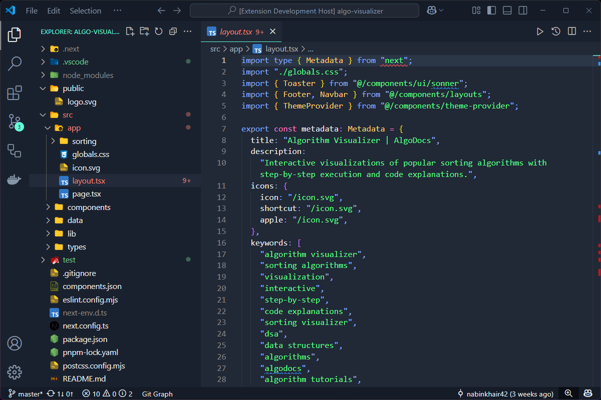

# V Icons
A minimalist and modern icon theme for Visual Studio Code that enhances your coding experience with carefully crafted icons.

  

## About

V Icons brings a fresh and clean look to your VS Code workspace with a carefully designed set of file and folder icons. The theme focuses on clarity and visual distinction while maintaining a modern aesthetic.

## Features

- 🎨 Clean and modern design
- 🎯 High contrast and easily distinguishable icons
- 📂 Beautiful folder icons (both closed and open states)
- 💡 Optimized for readability
- 🚀 Lightweight and performance-focused

## Installation

We are currently in development and testing phase. You can install the extension from the marketplace once it is published.

## License

This project is licensed under the MIT License - see the [LICENSE](LICENSE) file for details.

## Author

Created with ❤️ by [Nabin Khair](https://github.com/nabinkhair42)

## Acknowledgments

- Inspired by the need for clean and modern file icons
- Thanks to all contributors who help make this project better
